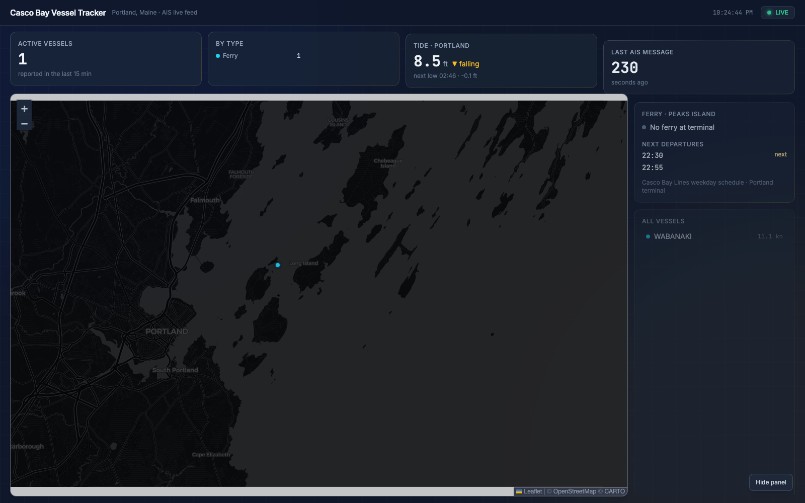

# Casco Bay Vessel Tracker

A live ship-tracking dashboard for Casco Bay, Maine — the waters around Portland,
Peaks Island, Long Island, and out toward Harpswell. It listens to real AIS radio
broadcasts (relayed over the internet by [AISstream.io](https://aisstream.io)),
plots every vessel on a dark live map, shows the current tide from NOAA, and
compares the Casco Bay Lines Peaks Island ferry schedule against which ferries
are actually at the Portland terminal.

Clicking any vessel opens a **Vessel Spotlight** — photo, specifications
(length, beam, tonnage, year built, flag), and history, pulled live from
Wikidata/Wikipedia (no API key needed; optional Datalastic support for deeper
coverage). When something notable is in the bay — a cruise ship, a big
tanker — it's automatically surfaced in a gold-accented **"In the Bay Now"**
strip with photo cards.



## How it works

- **AIS** (Automatic Identification System): ships broadcast their position,
  speed, heading, and identity over VHF radio. AISstream.io relays those
  broadcasts over a websocket, filtered to a bounding box around Casco Bay.
- A Python backend keeps the latest state of every vessel in memory, logs every
  position update to SQLite, and serves a small JSON API with Flask.
- A single-page frontend (Leaflet + Tailwind) polls the API every few seconds
  and slides markers smoothly to their new positions.

## Setup

1. Get a free API key from [aisstream.io](https://aisstream.io).
2. Copy the env template and paste in your key:
   ```bash
   cp .env.example .env
   # then edit .env: AISSTREAM_API_KEY=your_real_key
   ```
   `.env` is gitignored — never commit your real key.
3. Create a virtualenv and install dependencies:
   ```bash
   python3 -m venv venv
   source venv/bin/activate
   pip install -r requirements.txt
   ```

## Running

```bash
python server.py
```

Then open <http://127.0.0.1:5050>. The map fills in as vessels broadcast —
give it a minute, especially late at night when the bay is quiet.

To test just the AIS connection (prints every message it receives):

```bash
python ais_client.py
```

## Files

| File | What it does |
|---|---|
| `ais_client.py` | Connects to the AISstream websocket, parses messages, keeps the in-memory vessel store, logs positions to SQLite |
| `server.py` | Flask server: serves the frontend plus `/api/vessels`, `/api/tides` (NOAA station 8418150), `/api/ferry`, `/api/vessel-info`, and `/api/featured` |
| `vessel_info.py` | Vessel Spotlight lookups: Datalastic (optional key) → Wikidata/Wikipedia (free, keyless), cached in memory for 1 hour per MMSI |
| `ferry_schedule.json` | Casco Bay Lines weekday Portland → Peaks Island departures + terminal location |
| `static/index.html` | Dashboard layout (Tailwind, dark theme) |
| `static/app.js` | Map setup, polling, marker animation, sidebar logic |
| `vessel_history.db` | SQLite log of every position update (created on first run, gitignored) — for a future heatmap feature |

## Data sources

- Vessel positions: [AISstream.io](https://aisstream.io)
- Vessel photos, specs & history: [Wikidata](https://www.wikidata.org) and
  [Wikipedia](https://en.wikipedia.org) (notable vessels only — smaller craft
  show a clean "no additional info" state); optional [Datalastic](https://datalastic.com)
- Tides: [NOAA CO-OPS](https://tidesandcurrents.noaa.gov) station 8418150 (Portland, ME)
- Ferry schedule: [Casco Bay Lines](https://www.cascobaylines.com) published spring 2026 weekday schedule
- Map tiles: [CARTO](https://carto.com) dark basemap © OpenStreetMap contributors
